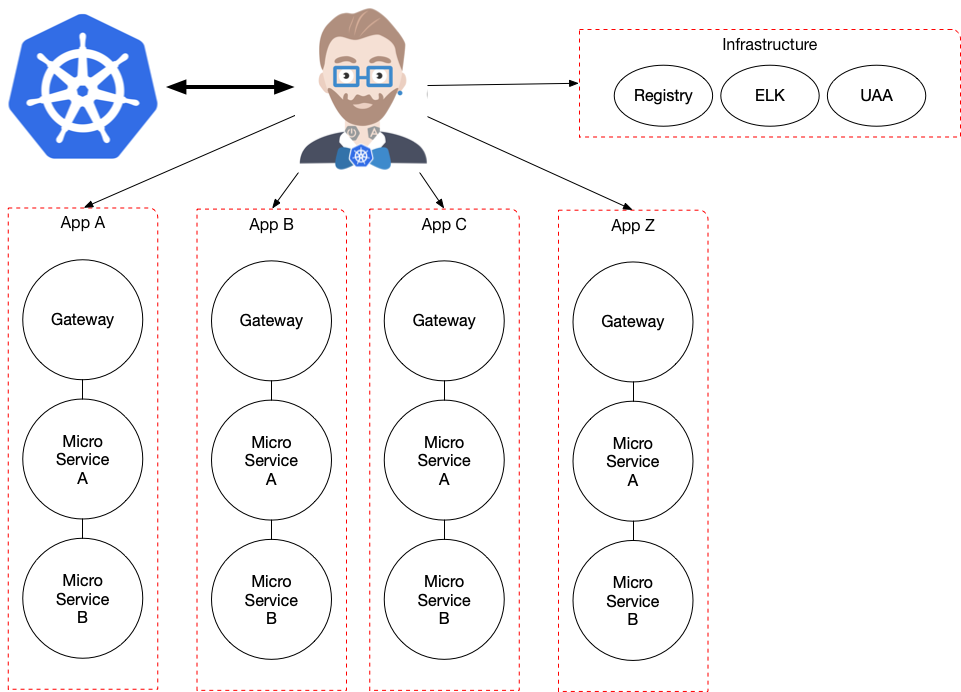
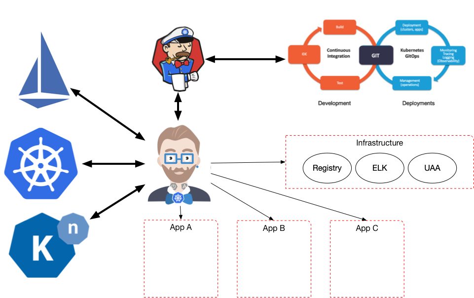

# JHipster Operator Getting Started Guide


On this step by step guide we will see how to install and work with the JHipster Kubernetes Operator.

First we will create an application, run it in Kubernetes KIND (local, if you don't have a cluster) and then we will deploy the 
JHipster Kubernetes Operator to teach Kubernetes about JHipster's Apps.

We will generate an Application form a JHipster JDL DSL, which describes a JHipster Application using the MicroServices approach. This application is composed by:
- A Gateway that also hosts the User Internface
- Invoice Service (which hosts three entities: Shipment, Order, Invoice)
- Review Service (which doesn't have any entity but will be in charge of reviewing the Invoice Service Entities)

You can find the [app.jdl](https://github.com/salaboy/jhipster-operator/blob/master/example-app/app.jdl) file in this repository.

You can find all the steps to run a [JHipster MicroService Application in Kubernetes KIND here](https://salaboy.com/2019/06/27/jhipster-microservice-application-in-kubernetes-kind/).
The operator example requires the previous application running in the cluster. 

# JHipster Operator



The JHipster Operators uses Kubernetes CRDs (Custom Resource Definitions) to encapsulate operational knowledge about JHipster Applications. 

Main objectives: 
- Understand JHipster Applications (root resource)
  - And Modules (Gateway, MicroServices, Registry..) (secondary/managed resources)
  - It makes K8s aware of these concepts
- Understand a JHipster Application topology
- Understand how things are wired together
- Understand and validate the Applications State as a whole
- Can provide hierarchical routing
- Can provide advanced lifecycle management
  - Shared infrastructure wiring
  - Garbage collection / Orphan Services
  - Versioning
  - Advanced Dynamic Traffic Routing
  - The use of Functions as part of applications

This operator requires the following CRDs to be deployed to the cluster: 
- applications.alpha.k8s.jhipster.tech
- gateways.alpha.k8s.jhipster.tech
- microservices.alpha.k8s.jhipster.tech
- registries.alpha.k8s.jhipster.tech

[These CRDs definitions can be found here](https://github.com/salaboy/jhipster-operator/tree/master/kubernetes/deploy/crds).

Because the Operator will run inside a Kubernetes Pod, we need to grant the Operator's deployment with a special Service Account, Role and Role Bindings for it to be able to 
interact with the Kubernetes APIs. [You can find these extra manifests here](https://github.com/salaboy/jhipster-operator/tree/master/kubernetes/deploy).

## (Optional) Building the Operator 

You can skip this section because a docker image is already provided in Docker Hub at **salaboy/jhipster-operator**

If you want to build the JHipster Operator from the Source Code you can clone the project from GitHub: http://github.com/salaboy/jhipster-operator

```
> git clone http://github.com/salaboy/jhipster-operator
> cd jhipster-operator/
> mvn clean install
```

Once the project is built, we can build the Docker Image from it
```
> docker build -t jhipster-operator .
```

Once we have the docker image ready we can share that with our KIND cluster

```
> kind load docker-image jhipster-operator
```

## Deploying the JHipster K8s Operator
In order to deploy the JHipster Operator you can run:
```
> cd kubernetes/
> bash deploy.sh 
```
> **Note**: by default the deployment.yaml file is using the Docker image hosted in Docker hub: **salaboy/jhipster-operator**, if you want to use your own, you will need to build it and then load it in KIND. As stated in the previous section. But you will also need to change the image reference inside the deployment.yaml file as well as the imagePullPolicy to Never. 

You should get the following output:
```
clusterrolebinding.rbac.authorization.k8s.io/jhipster-operator created
clusterrole.rbac.authorization.k8s.io/jhipster-operator created
deployment.apps/jhipster-operator created
serviceaccount/jhipster-operator created
service/jhipster-operator created
customresourcedefinition.apiextensions.k8s.io/applications.alpha.k8s.jhipster.tech created
customresourcedefinition.apiextensions.k8s.io/gateways.alpha.k8s.jhipster.tech created
customresourcedefinition.apiextensions.k8s.io/microservices.alpha.k8s.jhipster.tech created
customresourcedefinition.apiextensions.k8s.io/registries.alpha.k8s.jhipster.tech created
```

This script just apply all the manifests inside the **deploy/** and **deploy/crds** directory. 

There are three things happening here: 
- **Security**: create Role, RoleBinding and Service Account. This is required to grant access to our Operator to the Kubernetes APIs from inside a POD. This means that now the Operator has access to read and write Kubernetes Resources.  (Inside the deploy/ directory: cluster-role-binding.yaml, cluster-role.yaml and service-account.yaml)
- **Deploy Custom Resource Definitions**: these are JHipster Specific types that now Kubernetes understand. I have defined 4 CRDs: Application, MicroService, Gateway and Registry. These definitions can be located inside the **crds** directory. (all resources inside the deploy/crds/ directory)
- **Deployment**: Create the actual deployment that will use the security resources to operate our Custom Resource Definitions and how they relate to Kubernetes Native concepts. (inside the deploy/ directory: deployment.yaml and service.yaml)


Doing now:
```
> kubectl get pods
```

Should return our new **jhipster-operator-<hash>** pod, plus all the other pods from our application. 
we can tail the logs from the operator:
```
> kubectl logs -f jhipster-operator-<hash>
```

We should be able to see something like this in the logs:
```
tech.jhipster.operator.MyApplication     : + --------------------- RECONCILE LOOP -------------------- + 
tech.jhipster.operator.AppsOperator      : > No Healthy Apps found.
tech.jhipster.operator.MyApplication     : + --------------------- END RECONCILE  -------------------- +
```


## Interacting with the Operator
So now we are in a state where there is a JHipster Application (the one that we created with the app.jdl file) running in our cluster and the Operator running. In order to link the two worlds we can notify the Operator that now it needs to manage this application.

We can do that by sending the Operator the **app.jdl** file which contains the structure, so the Operator can validate that this application is up and running and make Kubernetes aware of this application specific concepts. 


First we need to expose the Operator to the outside world so we can send request to it:

```
> kubectl port-forward svc/jhipster-operator 8081:80 -n jhipster
```

We can do this by sending via HTTP a POST request to http://localhost:8081/apps/ with a JSON body containing:
```
{
  "name": "first-jhipster-app",
  "version": "1.0",
  "appJDLContent" : "<HERE APP.JDL Content>"
}
```

There is already a request.json inside the [example-app/](https://github.com/salaboy/jhipster-operator/blob/master/example-app/request.json) directory so you can do:
```
> http POST http://localhost:8081/apps/ < request.json
```

This will instruct the operator that a new JHipster Application is required and the operator will have the logic to map and validate the services that are running and create the JHipster resources based on the "app.jdl" description.

Now that the Operator has created the new resources in Kubernetes we can use the Kubernetes API to see our JHipster Applications and their modules.
Now you can do:
```
> kubectl get jh 
```
to get all the JHipster Applications.

```

```

Also you can get the modules by type:
```
> kubectl get ms (to get all microservices)
> kubectl get g (to get all gateways)
> kubectl get r (to get all registries)
```

You can also try describe on jh resources:
```
> kubectl describe jh <NAME OF THE APPLICATION HERE>
```

You can now, of course control these resources by calling the APIs directly and the Operator will react accordingly, due the reconcilation process (loop).
For example:
```
> kubectl delete jh <NAME OF THE APPLICATION HERE>
```

This will delete the Resource instance and the Operator will be notified about this change and update the list of available Applications. Notice
that the Kubernetes Garbage collection mechanism kick-in due the JHipster Application Reosource is the Owner of Microservices, Gateways and Registries.
This means that by deleting a JHipster App we will be also deleting all the associated modules. 


# TODOs / Future Work
- API Delete JHipster Application doesn't cascade, while kubectl does
- UPDATE greenwich SR1 version to final
- Update Spring boot version
- Define Operator Cloud Events
- Add Swagger docs
- Istio integration
- KNative integration
- Jenkins X / Tekton Pipelines integration


