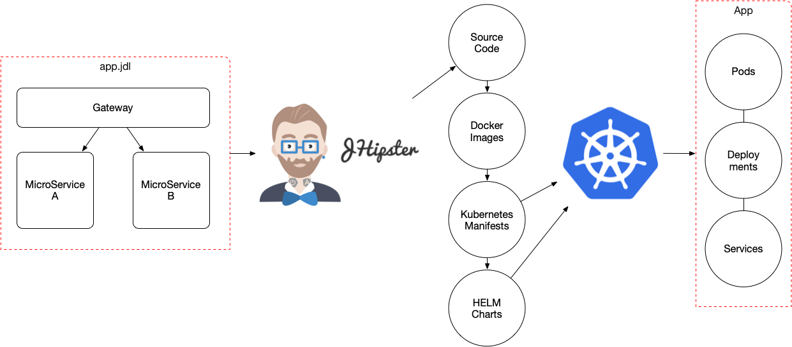

# JHipster MicroService Application in Kubernetes KIND

On this blog post I will be going through all the process from creating a MicroServices application with JHipster to run the application into a KIND 
Kubernetes cluster. 

KIND AND JHIPSTER LOGOS HERE

## Prerequisites
  - [JHipster CLI (Java, Maven)](https://www.jhipster.tech/installation/)
  - [Docker](https://docs.docker.com/docker-for-mac/install/)
    - You need to make sure that you allow Docker enough CPUs and memory to run the Applications (Docker -> Preferences -> Advanced). I've set up 4 CPUs and 8 GB RAM.
  - [kubectl](https://kubernetes.io/docs/tasks/tools/install-kubectl/)
  - [KIND](https://github.com/kubernetes-sigs/kind)


We will generate an Application form a JHipster JDL DSL, which describes a JHipster Application using the MicroServices approach. This application is composed by:
- A Gateway that also hosts the User Internface
- Invoice Service (which hosts three entities: Shipment, Order, Invoice)
- Review Service (which doesn't have any entity but will be in charge of reviewing the Invoice Service Entities)

You can find the [app.jdl](https://github.com/salaboy/jhipster-operator/blob/master/example-app/app.jdl) file in this repository.


# Generating the JHipster Application
In order to create the source code for this application we need to import our JDL file by calling (you can find the **app.jdl** file inside the 
[example-app/](https://github.com/salaboy/jhipster-operator/blob/master/example-app/) directory):
```
> jhipster import-jdl app.jdl
```

By running this command we will generate 3 maven projects:
1) gateway
2) invoice
3) review


Some details about these services: 
- Gateway will run by default in port 8080
- Invoice and Review will use 8081

# Running your application in Kubernertes

In order to run your application (microservices) in Kubernetes you need to generate Kubernetes Manifests, which are basically files 
that describe how Kubernetes will deploy and manage your services. 

In general to work with JHipster into Kubernetes you will follow these steps:



## Creating K8s Manifests

Today, there are three ways in which you can create the K8s manifests: 
1) You create your own manifests
2) You can use jhipster kubernetes generator
3) You can use jhipster kubernetes-helm generator

Let's use the second option for simplicity (but I encourage you to try the HELM approach as well):
```
> mkdir kubernetes/
> cd kubernetes/
> jhipster kubernetes
```

> **Note**: The generated manifest can be found inside [example-app/kubernetes/](https://github.com/salaboy/jhipster-operator/tree/master/example-app). 
> These manifests points to public docker images, if you want to use your locally generated images in KIND, you will need to modify the deployment manifests.

Then choose: 
1) Microservice application + Enter
2) root directory ../ + Enter
3) select the three services (gateway, invoice, review) with space and the arrows and then Enter
4) Monitoring -> No
5) Admin password (admin) Enter
6) namespace: I will use "jhipster" + Enter
7) name for the docker repository name (if you are planning to push your images to hub.docker.com) you should use your user name, I will use a local docker registry, so just Enter
8) docker push (default value) + Enter
9) No Istio for now
10) Service Type for your edge services (in this case the gateway), I will choose LoadBalancer + Enter

[An example of these manifests can be found here](https://github.com/salaboy/jhipster-operator/blob/master/example-app/kubernetes/)

After this all the Kubernetes Manifest to run your services are generated. The only missing step is to generate your docker images that are going to be used by these manifest to run your services in the cluster. 

The output of the generation shows how to create these docker images for each service. Everytime that you make a change in the service, you should generate a new docker image to contain those changes:

```
 To generate the missing Docker image(s), please run:
  ./mvnw -Pprod verify jib:dockerBuild in /gateway
  ./mvnw -Pprod verify jib:dockerBuild in /invoice
  ./mvnw -Pprod verify jib:dockerBuild in /review
```

You will also see in the output:
  ```
  WARNING! You will need to push your image to a registry. If you have not done so, use the following commands to tag and push the images:
  docker push gateway
  docker push invoice
  docker push review
  ```
This last step (of pushing the docker images) is only required if the Cluster is remote and you have no other way to make the images available to the cluster.

Now all you need is a cluster to run these services, welcome Kubernetes KIND. 

## Kubernetes KIND
[KIND](https://github.com/kubernetes-sigs/kind) stands for Kubernetes in Docker and based on their own description:
```
kind is a tool for running local Kubernetes clusters using Docker container "nodes".
kind is primarily designed for testing Kubernetes 1.11+, initially targeting the conformance tests.
```

This is a great tool because it allows us to run a multi node cluster only depending on Docker. We don't need any VM tooling such as Vagrant used in projects like Minikube, for example. 
Also the fact that KIND is targeting conformance tests, means that we have an hermetic environment where we can run our tests against a 
cluster that looks (from the API and topology prespective) pretty much as our production environments. 

KIND allows us to create and delete clusters in an automated fashion, then we can automate deploying our services into it. 
This becomes really important when we have services or Operators which needs to interact with the cluster, due we don't want to mock those interactions, 
we want to test the real cluster behaviour for our components. 

With KIND installed just run:
```
> kind create cluster
```

Once the cluster is up, you can try it out with 
```
> kubectl get pods
```

This should return 
```
No resources found.
```

## Deploying our application to KIND Cluster
Before moving forward we need to generate the docker images for our services, let's run what was suggested by the "jhipster kubernetes"
```
 To generate the missing Docker image(s), please run:
  ./mvnw -Pprod verify jib:dockerBuild in /gateway
  ./mvnw -Pprod verify jib:dockerBuild in /invoice
  ./mvnw -Pprod verify jib:dockerBuild in /review
```

Once this is done, we now should have 3 docker images loaded in our local Docker Deamon. Now we need to make these images available to KIND.
Which we can do with:

```
> kind load docker-image gateway
> kind load docker-image invoice
> kind load docker-image review
```

Before running the services, we need to adapt some of the Manifests to make sure that the Docker Images are not downloaded from a remote docker registry. 
**This is KIND specific.** And this is only required if you want to run with your own custom images. If you want to run this application in a remote cluster
the docker images for these services are published in Docker Hub:
  - salaboy/gateway:jhipster
  - salaboy/invoice:jhipster
  - salaboy/review:jhipster

We need to change the following files inside the kubernetes (manifest directory, generated by jhipster kubernetes.):
- gateway/gateway-deployment.yml
- invoice/invoice-deployment.yml
- review/review-deployment.yml
You need to locate the section:
```
  containers:
    - name: gateway-app
      image: gateway
```
add
```
imagePullPolicy: Never
```

like: 
```
  containers:
    - name: gateway-app
      image: gateway
      imagePullPolicy: Never
```

Also suggested by the generator to deploy all the services into K8s: 
```
> bash kubectl-apply.sh
```
The output should look like: 

```
namespace/jhipster created
configmap/application-config created
secret/registry-secret created
service/jhipster-registry created
statefulset.apps/jhipster-registry created
deployment.apps/gateway created
deployment.apps/gateway-mysql created
service/gateway-mysql created
service/gateway created
deployment.apps/invoice created
deployment.apps/invoice-mysql created
service/invoice-mysql created
service/invoice created
deployment.apps/review created
deployment.apps/review-mysql created
service/review-mysql created
service/review created

```

Notice that this created in the first line a new namespace called **jhipster** as it was instructred in the generator wizard.
Also notice that we are creating 3 pods which will run MySQL, and KIND will need to fetch from Docker Hub the MySQL docker image the first time that you run these commands.

In order to change the current namespace (so we can get resources without specifying the namespace everytime) we can switch to the jhipster one by running:
```
> kubectl config set-context $(kubectl config current-context) --namespace=jhipster
```

Once this is done we can check that our services are running:
```
> kubectl get pods
```

We should see all the Pods up and running:
```
gateway-9ffdb4796-jf2j2          1/1     Running   0          6m17s
gateway-mysql-6dc7d6dcf8-glgmz   1/1     Running   0          6m17s
invoice-6c8cb9f459-6m99n         1/1     Running   0          6m17s
invoice-mysql-7fbbbb77b6-kx5jr   1/1     Running   0          6m17s
jhipster-registry-0              1/1     Running   0          6m17s
jhipster-registry-1              1/1     Running   0          5m38s
review-7b9b756d95-txctz          1/1     Running   0          6m16s
review-mysql-6db96464bd-scvsw    1/1     Running   0          6m16s
```

Then to access the service, because we are running 
```
> kubectl port-forward svc/gateway 8080:8080 -n jhipster
```

Now you should be able to access your JHipster Application by pointing your browser to http://localhost:8080


# Conclusions
Now you can run your JHipster Applications using KIND, which enable you to have a repeatable environment which is really close to what a production environment will look like. 
Future work might include use KIND for integration testing of our JHipster Applications. 
If you have questions feel free to drop me a message here on in Twitter: @salaboy. 

